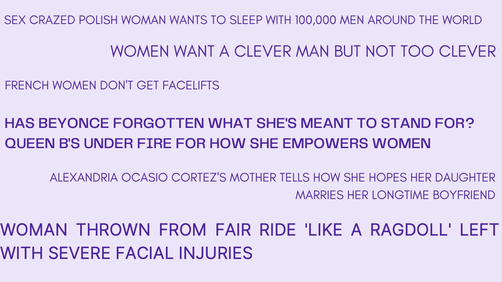
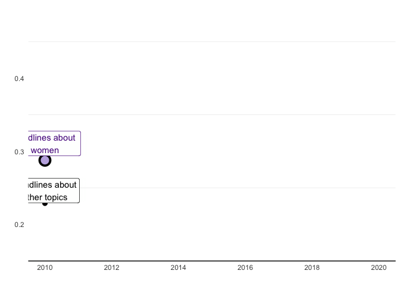

```{r setup, include=FALSE, echo=FALSE, warning=FALSE}
knitr::opts_chunk$set(echo = TRUE)
```

```{r libraries, echo=FALSE, warning = FALSE, message=FALSE}
library(tidyverse)     # for graphing and data cleaning
library(lubridate)     # for date manipulation
library(ggthemes)      # for even more plotting themes
library(gganimate)     # for adding animation layers to ggplots
library(RColorBrewer)  # for color palettes
library(viridis)
library(plotly)        # for the ggplotly() - basic interactivity
library(gganimate)     # for adding animation layers to ggplots
library(transformr)    # for "tweening" (gganimate)
library(gifski)        # need the library for creating gifs but don't need to load each time
library(gt)
library(maps)
library(ggmap)
theme_set(theme_minimal()) # My favorite ggplot() theme :)
```

```{r, echo=FALSE,  warning = FALSE, results=FALSE, comment=FALSE}
freq_theme_words <- read.csv("https://raw.githubusercontent.com/the-pudding/data/master/women-in-headlines/word_themes_freq.csv")
freq_country_words <- read.csv("https://raw.githubusercontent.com/the-pudding/data/master/women-in-headlines/word_country_freq.csv")
headline_site <- read.csv("https://raw.githubusercontent.com/the-pudding/data/master/women-in-headlines/headlines_site.csv")
word_theme_rank <- read.csv("https://raw.githubusercontent.com/the-pudding/data/master/women-in-headlines/word_themes_rank.csv")
headline_examples <- read.csv("https://raw.githubusercontent.com/the-pudding/data/master/women-in-headlines/headlines.csv")
polarity_site <- read.csv("https://raw.githubusercontent.com/the-pudding/data/master/women-in-headlines/polarity_comparison_site_country_time.csv")
polarity_over_time <- read.csv("https://raw.githubusercontent.com/the-pudding/data/master/women-in-headlines/polarity_comparison_country_time.csv")
```


```{r, echo = FALSE}
pivot_country_word <- freq_country_words %>% 
  pivot_longer(cols = -country,
               names_to = "word",
               values_to = "number") %>% 
  filter(word != "X") %>% 
  na.omit()
```

## Introduction

#### Our project investigates news headlines about women from many types of news sites in four different countries. Since much of the information we recieve daily about current events and popular culture comes from new sites, it is important to investigate any site-spanning tendencies or biases in the reporting about women. In this project, we examine four aspects of headlines about women: which words are most commonly used, how polarizing they are, and the typical bias of the sites and the average bias of all of a country's sites. To provide more context and to give some concrete examples, we have included a graphic with a few headlines from the data set. This article is examining how does the representation of women in news headlines differ from the portrayal of other topics in headlines? \n



## Data

#### For this project, we used data from The Pudding (we describe how they collected the data at the end). The data is composed of multiple datasets with different variables. One dataset contains information on the most common words, their frequency and their theme (crime and violence, empowerment, female stereotypes, people and places, race, ethnicity and identity, and no theme). Another dataset lists the headlines, which site published them, the country of the site, and the bias score for the headline. Other datasets included information on polarity of each site's headlines about women and about all topics for the past 10 years, the average bias for each site. 
\n

***


## The Words Used in Headlines
\n


### The Usage Frequency of the Words per Theme 
\n

##### Below is a bar graph that shows the cumulative frequency (how often a word appears accross all the headlines) of words in each theme. Each bar represents a different theme; the blocks within a bar represent the words that fall within each theme. The graph is interactive: you can view the word and its frequency that correspond to each block. This graph clearly shows that the words within the crime and violence theme are used the most frequently. We investigate the usage of specific words in this theme in the next graph.
\n


```{r, echo=FALSE, warning=FALSE, fig.width= 8, fig.height=6, fig.alt= "Bar Graph showing the cumulative frequency of words sorted by theme. The crime and violence has the most frequent use. The graph is interactive and allows the user to see the number of uses of each word in the theme."}
pivot_words <- freq_theme_words %>% 
  pivot_longer(cols = -theme,
               names_to = "word",
               values_to = "freq") %>% 
  na.omit()

word_plot <- pivot_words %>%
  #mutate(word = fct_infreq(word))%>%
  filter(theme != "No theme") %>% 
  ggplot(aes(x = fct_reorder(theme, desc(freq), sum), 
             y = freq, 
             fill = fct_reorder(theme, word),
             text = paste("word:", word))) +
    geom_col(color = "gray26", size = .1) +
    scale_fill_manual(values = c("lightskyblue2", "cornflowerblue", "slateblue1", "mediumpurple2", "#c1a0fa")) +
    theme(legend.position = "none") +
    labs(title = "Cumulative Frequency of Words Describing Women in Headlines",
       x = "",
       y = "Frequency")+
    theme(plot.title = element_text(hjust = 0.5))


ggplotly(word_plot,
         tooltip = c("y", "text"))
```


### Crime and Violence Words Displayed by Frequency
\n
#### This plot reveals how frequently each word, within the theme of crime and violence, is used. 'Kill' is the most common word, occuring nearly 8000 times in the dataset. 

```{r, echo=FALSE, warning=FALSE, fig.width= 6, fig.alt= "A column chart that shows the frequency of words in the crime and violence theme in descending order with kill being used the most frequently and horror being used the least frequently."}

pivot_words %>% 
  filter(theme == "crime and violence") %>% 
  ggplot(aes(y = fct_reorder(word, freq), x = freq)) +
    geom_col(fill = "mediumpurple2")+
    facet_wrap(~theme, scales = "free_y") +
    labs(y = NULL, x = NULL, fill = NULL) +
    theme(plot.title = element_text(hjust = 0.5),
        panel.grid.minor.x = element_blank(),
        panel.grid.major.y = element_blank(),
        panel.grid.minor.y = element_blank())+
  labs(title = "",
       subtitle = "")
```

### Top Five Most Frequent Words per Theme
#### Here, we display the top 5 most frequently occuring words in each theme (in this plot we have included words with 'no theme'). The word 'man' appears almost three times more frequently than the average frequency of all words.  
\n

```{r, echo=FALSE, fig.alt= "A column chart that shows the top five words for each theme. Man, from no theme, is the word used most frequently."}
word_theme_rank %>% 
  filter(`rank` < 6) %>% 
  select(!`X`) %>% 
  ggplot(aes(y = fct_reorder(word, theme), x = count)) +
  geom_col(aes(fill = theme))+
  scale_fill_manual(values = c("lightskyblue2", "cornflowerblue", "slateblue1", "mediumpurple2", "#c1a0fa", "#dca0fa")) +
  theme(plot.title = element_text(hjust = 0.5))+
  labs(title = "",
       y = "",
       x = "") +
      theme(plot.title = element_text(hjust = 0.5),
        panel.grid.minor.x = element_blank(),
        panel.grid.major.y = element_blank(),
        panel.grid.minor.y = element_blank())
  
```

*** 

## Data by Country
\n

### Country Map
\n

##### Data was taken from news sites from four different countries with varying numbers of news sources used. From the United States of America, 86 new sites were used. From the United Kingdom, 41 news sites were used. From South Africa, 23 news sites were used. From India, 36 news sites were used. 
\n

```{r, echo=FALSE, warning = FALSE, fig.alt= "A world map that highlights the four countries that data was taken from; the USA, the UK, South Africa, and India."}
world_map <- map_data("world")

headline_site %>% 
  group_by(country_of_pub) %>% 
  summarise(bias_country = mean(bias)) %>% 
  ggplot() +
    geom_map(data = world_map, map = world_map,
             aes(long, lat, map_id = region),
             fill = "#e7defa")+
    geom_map(map = world_map,
            aes(map_id = `country_of_pub`),
            fill = "mediumpurple2",
            color = "mediumpurple2")+
    expand_limits(x = world_map$long, y = world_map$lat) + 
    theme_map()
```

### Bias Score by Country
\n
##### The following column chart displays the mean bias by country along with the maximum bias of a headline published by a site in the country. The minimum bias score is zero for all countries so no visual representation was added. The UK has the highest average bias as well as the highest maximum bias.
\n

```{r, echo=FALSE, fig.alt= "A column chart that shows the average bias score of headlines by country along with the maximum bias score from the country."}
headline_site %>%
  group_by(country_of_pub) %>%
  summarize(mean_bias = mean(bias), max_bias = max(bias)) %>% 
  ggplot()+
  geom_col(aes(y = country_of_pub, x = max_bias), 
           fill = "#e7defa", width = .75)+
  geom_col(aes(y = country_of_pub, x = mean_bias), 
           width = .5, fill = "mediumpurple2")+
  geom_text(aes(y= country_of_pub, x = mean_bias, label = round(mean_bias, 3)),
            color = "mediumpurple2",
            hjust = -0.2, size = 3, position = position_dodge(width = 1))+
  geom_text(aes(y= country_of_pub, x = max_bias, label = round(max_bias, 3)),
            color = "#c1a0fa",
            hjust = -0.2, size = 3, position = position_dodge(width = 1))+
  scale_x_continuous(limits = c(0, 1))+
  labs(title = "Average and Maximum Bias Score by Country",
       x = NULL,
       y = "")+
  theme(plot.title = element_text(hjust = 0.5),
        panel.grid.minor.x = element_blank(),
        panel.grid.major.y = element_blank(),
        panel.grid.minor.y = element_blank())
```

***

## The Polarity of Headlines
\n

### Polarity over Time
\n
##### In this graph, we visualize how the polarity of headlines has changed over the past ten years. The polarity scores represent how sensationalized a headline is. Sensational headlines sacrifice accuracy in an attempt to provoke an emotional response from readers. They are designed to generate interest through emotional manipulation. In general, the polarity of news headlines about women is higher than the polarity for other headlines. In the past ten years, polarity has increased, and the gap between the polarity of headlines about women and the polarity of general headlines has widened.
\n

```{r, echo=FALSE, warning=FALSE, message=FALSE}
polarity_time_anim <- polarity_over_time %>% 
  group_by(`year`) %>% 
  summarise(women_mean = mean(`women_polarity_mean`),
            all_mean = mean(`all_polarity_mean`),
            year) %>% 
  ungroup() %>% 
  ggplot()+
  geom_line(aes(x=`year`, y=`women_mean`), color = "mediumpurple2", se = FALSE)+
  geom_line(aes(x=`year`, y=`all_mean`), color = "black", se = FALSE)+
  geom_point(aes(x=`year`, y=`women_mean`),
             color = "black", fill = "#c2b1e3",
             size = 5, stroke = 2, shape = 21) +
  geom_point(aes(x=`year`, y=`all_mean`), size = 2.5)+
  geom_label(label = "Headlines about \nwomen", aes(x=`year`, y= `women_mean`), 
             color = "purple4", position = position_nudge(x = 0, y = 0.023))+
  geom_label(label = "Headlines about\nother topics", aes(x=`year`, y= `all_mean`),
             position = position_nudge(x = 0, y = 0.0173))+
  scale_x_continuous(breaks = c(2010, 2012, 2014, 2016, 2018, 2020))+
  labs(title = "",
       y = "",
       x = "")+
  theme(plot.title = element_text(hjust = 0.5),
        panel.grid.major.x = element_blank(),
        panel.grid.minor.x = element_blank(),
        panel.grid.major.y = element_blank(),
        axis.line.x = element_line(color = "black"))+
  transition_reveal(year)

anim_save("polarity_time_anim.gif",
          animate(polarity_time_anim, end_pause = 10))
```

```{r, echo=FALSE, warning=FALSE, message=FALSE, fig.alt="An animated line graph that shows the bias over time for headlines about women and headlines about other topics. The bias for headlines about women has consistently been higher."}

```

### Polarity of News Sites
\n
##### In the graph below, the difference in the average polarity score between headlines about women and other headlines are shown for each site. The sites are ordered by the largest average polarity of headlines about women. Almost every site's headlines about women are more polarizing than their headlines about other topics. 
\n

```{r, fig.height= 24, fig.width= 8, echo=FALSE, fig.alt="A chart that shows the difference in polarity for all news sites that data was taken from. Most of the sites have a higher polarity in regards to headlines about women compared to headlines about other topics. The daily sun has by far the largest difference in polarity of its headlines."}
polarity_site %>% 
  ggplot()+
  geom_segment(aes(x=polarity_base, xend=polarity_women, y=fct_reorder(site, polarity_women), yend=site), size = 1)+
  geom_point(aes(x=polarity_base, y = site), size = 2)+
  geom_point(aes(x=polarity_women, y = site), color = "black", fill = "#c1a0fa", 
             size = 3, stroke = 1, shape = 21)+
  labs(title = "",
       y = "",
       x = "Polarity")+
  theme(plot.title = element_text(hjust = 0.5),
        panel.grid.major.x = element_blank(),
        panel.grid.minor.x = element_blank())+
  annotate("label", x = .1, y = 176, label = "Average Polarity of \n Headlines About Women", color = "mediumpurple2")+
  annotate("label", x = .1, y = 172, label = "Average Polarity of \n General Headlines")+
  labs(title = "")
```

***

## Headline Examples
\n
#### Below we show a few more examples of headlines along with their site, country and bias score. The first table shows a subset of the least biased headlines about women, and the second table show a few of the most biased headlines. 
```{r, echo=FALSE, fig.alt="A table with three examples of headlines with very low bias scores."}
last_three_headlines <- headline_examples %>% 
  rename("Headline" = `headline_no_site`,
         "Site" = `site`,
         "Country" = `country`,
         "Bias" = `bias`) %>%
  arrange(`Bias`) %>%
  distinct(Site, .keep_all = TRUE) %>% 
  slice(1:3) %>% 
  select(`Headline`, `Site`, `Country`, `Bias`)

last_three_headlines_table <- gt(last_three_headlines) %>% 
  tab_header(title = "Least Biased Headline Examples") #%>% 
  #tab_style(style = cell_text(color = "mediumpurple2"),
           # locations = cells_column_labels())

last_three_headlines_table
```

\n
\n

```{r, echo=FALSE, fig.alt="A table with three examples of highly biased headlines."}
top_three_headlines <- headline_examples %>% 
  rename("Headline" = `headline_no_site`,
         "Site" = `site`,
         "Country" = `country`) %>% 
  filter(Site != "dailymail.co.uk") %>% 
  mutate(Bias = round(bias, digits = 3)) %>% 
  arrange(desc(`Bias`)) %>%
  distinct(Site, .keep_all = TRUE) %>% 
  slice(1:3) %>% 
  select(`Headline`, `Site`, `Country`, `Bias`)

top_three_headlines_table <- gt(top_three_headlines) %>% 
  tab_header(title = "Most Biased Headline Examples") #%>% 
  #tab_style(style = cell_text(color = "purple4"),
            #locations = cells_body())

top_three_headlines_table
```
\n
***

## More Information About the Data 
\n
### Data Calculations
\n

#### Polarity Calculations: The Pudding measured polarity by using a package in python which measured the sentiment (negative to positive) of each headline (a score from -1 to 1). The polarity is the absolute value of these scores. 

#### Bias Calculations: The Pudding measured gender bias in two steps. First, they checked if the headline used gendered language ('she', 'bride', 'daughter', ...). If it did, they counted the number of words that are stereotypes about women ('weak', 'sexy', 'emotional', ...). Then, they normalized this count so each site had a score between 0 and 1. 

### Data Source\n
https://github.com/the-pudding/data/tree/master/women-in-headlines


### Original Article\n
https://pudding.cool/2022/02/women-in-headlines/


